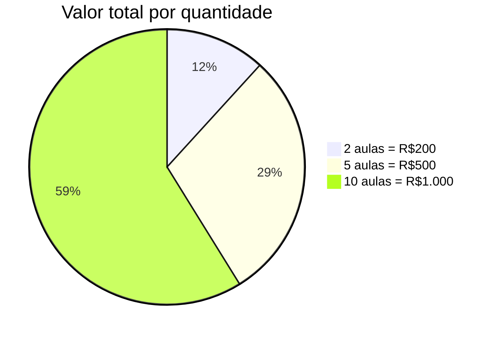
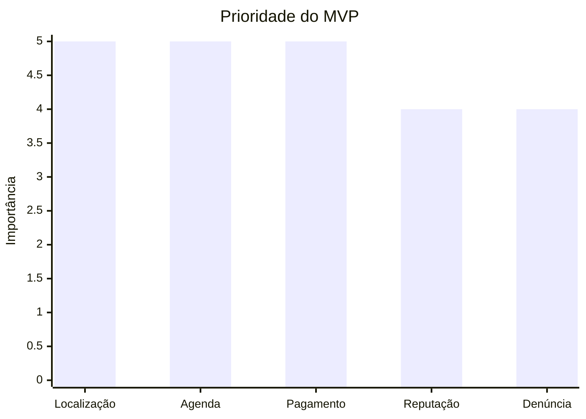

# 🚗 Zayro — estrutura completa do MVP simplificado

> **Versão pública, visual e correta para leitura do cliente.**

  

## 🧭 Visão geral do produto

O **Zayro** é uma plataforma nacional de conexão entre **candidatos à CNH** e **instrutores práticos de direção**.

O aplicativo funciona como:

- 🪪 vitrine de instrutores;
- 🗓️ agenda prática;
- ⏰ organização de horários;
- 💳 pagamento;
- ⭐ avaliação;
- 🔗 intermediação operacional.

## 🎯 Objetivo do MVP

| Objetivo | O que significa |
|---|---|
| Simples | Fluxo direto, sem excesso de etapas |
| Rápido | Entendimento e uso sem fricção |
| Escalável | Base pronta para crescer no Brasil |
| Funcional | Resolve a contratação de aulas práticas |
| Expansível | Permite evolução sem quebrar o núcleo |

## 🚫 O que o MVP não utiliza

| Não utilizar | Motivo |
|---|---|
| Inteligência artificial | Não faz parte desta fase |
| Match psicológico | Complexidade fora do escopo |
| Distribuição automática complexa | MVP precisa ser previsível |
| Onboarding emocional | Fluxo deve ser direto |
| Lógica avançada de recomendação | A lógica principal é operacional |

## 🧠 Lógica principal do produto

O Zayro trabalha com cinco pilares:

| Pilar | Papel no produto |
|---|---|
| 📍 Localização | Encontrar instrutores na cidade/região |
| 🗓️ Agenda | Exibir disponibilidade real |
| ⏱️ Disponibilidade | Mostrar horários livres |
| 💳 Pagamento | Confirmar a contratação |
| ⭐ Reputação do instrutor | Dar prioridade e destaque |

### 🔄 Fluxo visual

```mermaid
flowchart LR
  A[Apresentação] --> B[Situação]
  B --> C[Cadastro]
  C --> D[Localização]
  D --> E[Categoria]
  E --> F[Instrutores]
  F --> G[Perfil]
  G --> H[Quantidade de aulas]
  H --> I[Datas e horários]
  I --> J[Resumo]
  J --> K[Termos]
  K --> L[Pagamento]
  L --> M[Confirmação]
```

## 🏷️ Categorias disponíveis

| Categoria | Descrição |
|---|---|
| **A** | Moto 🏍️ |
| **B** | Carro 🚗 |
| **AB** | Moto e carro 🏍️🚗 |

### Não exibir

- Categoria C
- Categoria D
- Categoria E
- Mudança de categoria
- Adição de categoria

## 👤 Fluxo completo do candidato

| # | Etapa |
|---|---|
| 1 | Apresentação |
| 2 | Situação do candidato |
| 3 | Cadastro |
| 4 | Localização |
| 5 | Categoria |
| 6 | Lista de instrutores |
| 7 | Perfil do instrutor |
| 8 | Quantidade de aulas |
| 9 | Escolha de datas e horários |
| 10 | Resumo do pedido |
| 11 | Aceite dos termos |
| 12 | Pagamento |
| 13 | Confirmação final |

## 🪜 Jornada detalhada

### 1. Apresentação

**Título:** “Encontre instrutores práticos de direção na sua cidade”

**Texto:** “Escolha um instrutor, organize seus horários e agende suas aulas práticas diretamente pelo aplicativo.”

**Botão:** “Começar”

**Texto secundário:** “O Zayro é uma plataforma independente de conexão entre candidatos e instrutores práticos de direção.”

### 2. Situação do candidato

**Título:** “Qual é a sua situação?”

**Texto:** “Isso ajuda o instrutor a entender melhor seu momento.”

**Opções:**

1. Primeira habilitação
2. Já sou habilitado, mas me sinto inseguro
3. Retorno após reprovação

> ℹ️ Essa informação serve apenas como contextualização simples para o instrutor.

### 3. Cadastro

**Título:** “Vamos criar seu cadastro”

**Campos obrigatórios:**

- Nome completo
- CPF
- Data de nascimento
- Telefone
- E-mail

### 4. Localização

**Título:** “Onde você deseja realizar suas aulas?”

**Campos:**

- Estado
- Cidade

**Regra:** o sistema buscará instrutores cadastrados naquela cidade. Se não houver, deve sugerir cidades próximas.

### 5. Escolha da categoria

**Título:** “Qual categoria você deseja praticar?”

**Opções:**

- A — Moto
- B — Carro
- AB — Moto e carro

### 6. Lista de instrutores

**Título:** “Instrutores disponíveis na sua região”

Cada card deve mostrar:

- Foto
- Nome
- Categoria atendida
- Avaliação média
- Quantidade de avaliações
- Cidade
- Ponto de encontro
- Pequena descrição profissional
- Próximos horários disponíveis

#### Exemplo de card

| Campo | Conteúdo |
|---|---|
| Nome | João Carlos |
| Categoria | B — Carro |
| Avaliação | ⭐ 4,9 (124 avaliações) |
| Cidade | Cuiabá — MT |
| Ponto de encontro | Shopping Pantanal |
| Descrição | Instrutor com foco em candidatos iniciantes e preparação para prova prática. |

### 7. Perfil completo do instrutor

Ao abrir o perfil, mostrar:

- Foto maior
- Nome completo
- Categoria atendida
- Cidade
- Avaliação
- Quantidade de avaliações
- Texto de apresentação
- Ponto de encontro
- Agenda disponível

**Opcional:**

- Tempo de experiência
- Especialidade
- Modalidade atendida

Exemplos de modalidade:

- Primeira habilitação
- Reforço para prova prática
- Aulas para candidatos inseguros

### 8. Quantidade de aulas

**Título:** “Quantas aulas você deseja agendar?”

**Texto:** “Você pode escolher livremente a quantidade de aulas.”

**Opções rápidas:**

- 2 aulas
- 5 aulas
- 10 aulas
- 15 aulas

**Quantidade mínima:** 2 aulas.

### 9. Valor das aulas

| Tipo | Valor |
|---|---|
| Aula de carro | R$100 |
| Aula de moto | R$100 |

O sistema calcula automaticamente:

**Quantidade × valor da aula**

### 10. Escolha das datas

**Título:** “Escolha os horários das suas aulas”

**Texto:** “Os horários abaixo seguem a disponibilidade do instrutor.”

O candidato escolhe:

- datas;
- horários;
- quantidade de aulas.

### 11. Resumo do pedido

**Título:** “Resumo do agendamento”

Mostrar:

- Nome do instrutor
- Categoria
- Quantidade de aulas
- Valor por aula
- Valor total
- Datas escolhidas
- Horários
- Ponto de encontro

### 12. Aceite dos termos

**Título:** “Antes de finalizar”

**Checkboxes obrigatórios:**

1. Li e aceito os Termos de Uso da Plataforma.
2. Li e aceito a Política de Cancelamento e Reagendamento.
3. Li e aceito a Política de Segurança e Conduta.
4. Declaro estar ciente de que o Zayro apenas intermedia a conexão entre candidato e instrutor.

Se não aceitar:

> É necessário aceitar os termos para continuar.

### 13. Pagamento

**Título:** “Finalizar pagamento”

**Formas de pagamento:**

- Pix
- Cartão de crédito
- Cartão de débito

**Mensagem:** “Parcelamentos podem possuir juros da operadora do cartão.”

> 📌 A agenda só é reservada após aprovação do pagamento.

### 14. Confirmação final

**Título:** “Aulas confirmadas”

**Texto:** “Sua preparação prática foi agendada com sucesso.”

Mostrar:

- Nome do instrutor
- Datas
- Horários
- Ponto de encontro
- Botão de localização

**Mensagem:** “O aluno deverá comparecer ao ponto de encontro informado. O instrutor não realiza busca em residência.”

## 👨‍🏫 Operação pós-aula

### Finalização da aula pelo instrutor

Botões:

- Aula concluída
- Candidato faltou
- Denunciar comportamento inadequado

### Confirmação pelo candidato

Se o instrutor confirmar a aula, o candidato responde:

**“A aula ocorreu corretamente?”**

Opções:

- Confirmar aula
- Abrir disputa
- Denunciar comportamento inadequado

### Avaliação do instrutor

Perguntas:

1. O instrutor foi pontual?
2. O instrutor explicou com clareza?
3. Você se sentiu seguro durante a aula?
4. O instrutor foi respeitoso?
5. Como você avalia a experiência geral?

Campo:

- “Deseja deixar comentário para análise interna?”

> Os comentários não são públicos e não aparecem diretamente ao instrutor.

### Reputação

| Situação | Resultado |
|---|---|
| Instrutor bem avaliado | Aparece primeiro e ganha destaque |
| Instrutor mal avaliado | Perde prioridade e visibilidade |

## 💸 Regras financeiras e de cancelamento

### Candidato faltou

Se o instrutor marcar “Candidato faltou”:

| Distribuição | Valor |
|---|---|
| Instrutor | R$25 |
| Plataforma | R$75 |
| Crédito ao candidato | Não há |

O candidato perde a aula e não recebe reagendamento.

### Cancelamento com mais de 24 horas

- crédito integral;
- possibilidade de reagendamento.

### Cancelamento com menos de 24 horas

| Destino | Valor |
|---|---|
| Instrutor | R$25 |
| Plataforma | R$25 |
| Crédito do candidato | R$50 |

### Cancelamento pelo instrutor

O candidato pode:

- escolher outro horário;
- ou escolher outro instrutor.

### Crédito interno do instrutor

O dinheiro do instrutor vai para uma carteira interna.

| Opção | Regra |
|---|---|
| Saque | Semanal, quinzenal ou mensal |
| Saque mínimo | R$500 |

## 🚨 Denúncias e tolerância zero

**Categorias de denúncia:**

- Assédio
- Importunação sexual
- Discriminação
- Racismo
- Homofobia
- Violência
- Intimidação
- Conduta inadequada
- Outro

**Campo obrigatório:** “Descreva o ocorrido”

### Política de tolerância zero

Aplica-se a:

- abuso sexual;
- importunação sexual;
- assédio;
- discriminação;
- racismo;
- homofobia;
- violência;
- intimidação.

### Ação quando a denúncia é contra o instrutor

- bloqueio imediato;
- suspensão da agenda;
- remoção de visibilidade;
- análise interna.

### Ação quando a denúncia é contra o candidato

- suspensão do candidato;
- bloqueio de novos agendamentos;
- análise interna.

## 📚 Termos da plataforma

O candidato deve aceitar:

- Termos de Uso;
- Política de Cancelamento;
- Política de Reagendamento;
- Política de Segurança;
- Política de Avaliação.

## 🛡️ Responsabilidades

### Responsabilidade do instrutor

| Item | Responsabilidade |
|---|---|
| Veículo | Do instrutor |
| Documentação | Do instrutor |
| Manutenção | Do instrutor |
| Multas | Do instrutor |
| Acidentes | Do instrutor |
| Condução da aula | Do instrutor |
| Segurança operacional | Do instrutor |

### Responsabilidade do Zayro

O Zayro:

- não fornece veículo;
- não executa aulas;
- não é autoescola;
- não responde por acidentes ou condução.

O aplicativo apenas:

- intermedia;
- organiza agenda;
- conecta candidato e instrutor;
- processa pagamentos.

## ❗ Telas de erro necessárias

| Erro | Situação |
|---|---|
| Campos obrigatórios não preenchidos | Validação de formulário |
| CPF inválido | Entrada incorreta |
| Telefone inválido | Entrada incorreta |
| E-mail inválido | Entrada incorreta |
| Cidade sem instrutor | Sem oferta na região |
| Sem horários disponíveis | Agenda cheia |
| Pagamento recusado | Transação falhou |
| Pix expirado | Tempo limite excedido |
| Falha de conexão | Problema de rede |
| Termos não aceitos | Bloqueio de avanço |
| Reagendamento indisponível | Sem opção viável |
| Conta suspensa | Restrição de acesso |
| Denúncia recebida | Fluxo de análise |
| Saque indisponível | Regra financeira |
| Horário já reservado | Conflito de agenda |
| Instrutor indisponível | Sem disponibilidade |

Cada erro deve ter:

- mensagem clara;
- botão de retorno;
- orientação do próximo passo.

## 📈 Leitura executiva do produto

## 📌 Fechamento

Este MVP prioriza:

- simplicidade;
- estabilidade;
- velocidade;
- agenda funcional;
- pagamento;
- reputação;
- avaliações;
- denúncias;
- crédito interno;
- experiência fluida.

> O foco é fazer o candidato encontrar, agendar e pagar aulas práticas com facilidade.
