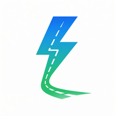

# 🚗 Zayro

> **Documentação pública oficial do MVP simplificado.**

  

## ✨ O que é o Zayro?

O Zayro é uma plataforma nacional de conexão entre candidatos à CNH e instrutores práticos de direção.

## 🎯 O que você encontra aqui

- visão geral do produto;
- fluxo completo do candidato;
- regras do MVP;
- identidade visual;
- especificação resumida;
- roadmap público;
- roadmap de execução e contrato comercial.

## 📚 Acesse a documentação

| Documento | Link |
|---|---|
| Visão geral | [Abrir](./docs/01-visao-geral.md) |
| Fluxo do cliente | [Abrir](./docs/02-fluxo-do-cliente.md) |
| Regras e escopo | [Abrir](./docs/03-regras-e-escopo.md) |
| Identidade visual | [Abrir](./docs/04-identidade-visual.md) |
| Especificação MVP | [Abrir](./docs/05-especificacao-mvp.md) |
| Roadmap público | [Abrir](./docs/06-roadmap-publico.md) |
| Roadmap de execução | [Abrir](./docs/07-roadmap-execucao.md) |
| Contrato de prestação de serviços | [Abrir](./CONTRATO-PRESTACAO-SERVICOS.md) |

## 🔗 Link oficial

Quando o GitHub Pages estiver ativo, este será o endereço público oficial do projeto:

**https://deivisan.github.io/zayro-client-docs/**
